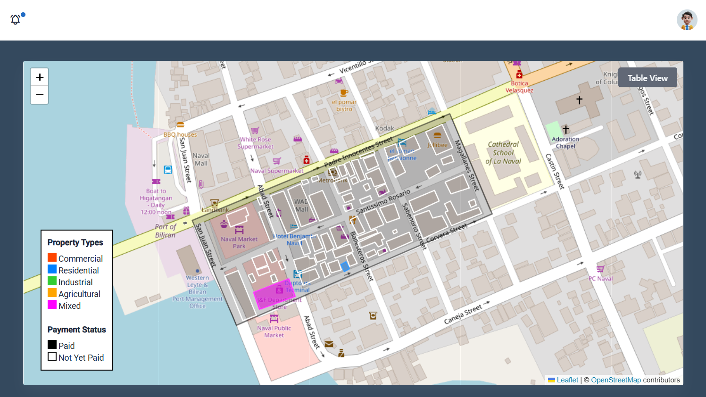

# Real Property Tax Mapping with Tax Collection System

A web-based GIS for real property tax monitoring and collection. Built with Leaflet.js, PHP, and MySQL — renders property parcels as an interactive map with payment status visualization, paired with a full tax collection workflow.



## Features

- **Interactive Property Map** — Color-coded property polygons by type (Commercial, Residential, Industrial, Agricultural, Mixed). Paid properties are filled; unpaid are outlined.
- **Map / Table Toggle** — Switch between the Leaflet map and a DataTable-powered tabular view.
- **Hover Tooltips** — Hover any property to see name, type, lot number, and payment status.
- **Multi-Stage Request Workflow** — Applicant submits → Staff reviews & computes tax → Admin approves → Treasurer records payment.
- **Tax Computation Engine** — Calculates assessed value, basic tax, SEF, and total tax due from market value and assessment rate.
- **Collection Reports** — Barangay-level collection overview with ApexCharts, efficiency rate tracking, and installment support.
- **Four User Roles** — Admin, Staff, Treasurer, and Applicant with role-specific dashboards and permissions.

## Tech Stack

- **Frontend:** Leaflet.js, ApexCharts, DataTables, Bootstrap 5, jQuery
- **Backend:** PHP (PDO & MySQLi)
- **Database:** MySQL (`real_property_tax`)
- **Maps:** GeoJSON boundary data & JSON-encoded coordinate polygons per parcel

## User Roles

| Role | Access |
|------|--------|
| **Admin** | Full system management, user management, request approval, reports, map dashboard |
| **Staff** | Reviews requests, approves/rejects with feedback, computes tax |
| **Treasurer** | Records payments, manages OR numbers, views collection reports |
| **Applicant** | Submits tax declaration requests, uploads documents, tracks status and payment history |

## Project Structure

```
├── admin/                     # Province-level admin panel
├── staff/                     # Request review and tax computation
├── treasurer/                 # Payment and collection management
├── applicant/                 # Property owner panel
├── assets/
│   ├── css/                   # Stylesheets
│   ├── js/                    # Dashboard & sidebar scripts
│   ├── json/                  # GeoJSON and property coordinate data
│   ├── libs/                  # Third-party libraries
│   ├── images/                # Uploads, profile images, preview.png
│   └── scss/                  # SCSS source files
├── PHPMailer-6.9.2/           # Email library
├── conn.php                   # Database connection (gitignored)
├── conn.example.php           # Connection template
├── function.php               # Core application logic
├── navigate.php               # Request routing
├── session.php                # Session management
├── login.php                  # Master login page
├── properties.php             # Property coordinate seeder
└── real_property_tax.sql      # Database schema & sample data
```

## Setup

### Prerequisites

- PHP 8.0+
- MySQL 5.7+ / MariaDB 10.3+
- Web server (Apache/Nginx) — Laragon recommended for Windows

### Installation

1. **Clone the repository**

```bash
git clone <repo-url>
cd real-property-tax-mapping
```

2. **Database setup**

```bash
mysql -u root -p real_property_tax < real_property_tax.sql
```

3. **Configure database connection**

Copy `conn.example.php` to `conn.php` and update credentials:

```php
private $hostdb = "localhost";
private $userdb = "root";
private $passdb = "";
private $namedb = "real_property_tax";
```

4. **Serve the application**

Using Laragon, access at:

```
http://real-property-tax-mapping.test
```

5. **Seed property coordinates (optional)**

```bash
php properties.php
```

Loads polygon coordinates from `assets/json/properties_coordinates.json` into the `properties` table.

### Login URLs

- Admin: `/admin/admin_login.php`
- Staff: `/staff/staff_login.php`
- Treasurer: `/treasurer/treasurer_login.php`
- Applicant: `/applicant/applicant_login.php`

## Map Data

The property map is centered on **Naval, Biliran** as the sample area. Properties are stored as JSON coordinate arrays and rendered as Leaflet polygons. Future development can extend coverage to full municipal or provincial boundaries.

## License

MIT — see [LICENSE](LICENSE).