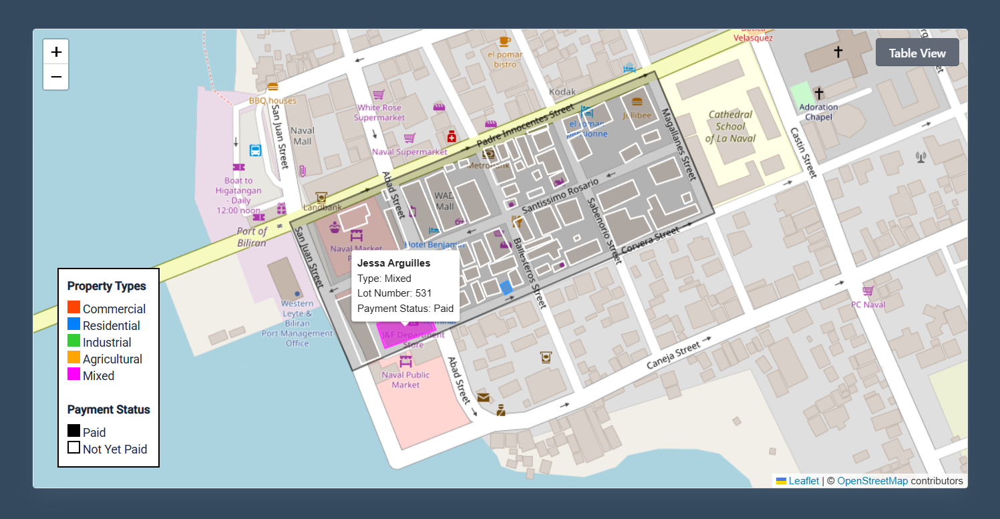

# Real Property Tax Mapping with Tax Collection System

A web-based Geographic Information System (GIS) for real property tax monitoring and collection. Built with Leaflet.js, PHP, and MySQL, it renders property parcels as an interactive map with payment status visualization, paired with a full tax collection workflow.



## Features

- **Interactive Property Map** — Leaflet.js map with color-coded property polygons (Commercial, Residential, Industrial, Agricultural, Mixed). Paid properties are filled; unpaid are outlined.
- **Map / Table Toggle** — Switch between map view and a DataTable-powered tabular view of all properties.
- **Hover Tooltips** — Hover over any property to see name, type, lot number, and payment status.
- **Multi-Stage Request Workflow** — Applicants submit requests → Staff reviews & computes tax → Admin final approval → Treasurer records payment.
- **Tax Computation Engine** — Calculates assessed value, basic tax, SEF, and total tax due from market value and assessment rate.
- **Collection Reports & Charts** — Barangay-level collection overview with ApexCharts, efficiency rate tracking.
- **Payment Management** — OR number tracking, payment date, due date, installment support.
- **Four User Roles** — Admin, Staff, Treasurer, and Applicant with role-specific dashboards and permissions.

## Tech Stack

- **Frontend:** Leaflet.js, ApexCharts, DataTables, Bootstrap 5, jQuery
- **Backend:** PHP (PDO & MySQLi)
- **Database:** MySQL (`real_property_tax`)
- **Maps:** GeoJSON boundary data & JSON-encoded coordinate polygons for each parcel

## User Roles

| Role | Access |
|------|--------|
| **Admin** | Full system management, user management (admin, staff, applicants), request approval, reports, map dashboard |
| **Staff** | Reviews property requests, approves/rejects with feedback, computes tax (market value, assessment rate, tax due) |
| **Treasurer** | Manages payments and transactions, records OR numbers, views collection reports and efficiency |
| **Applicant** | Registers, submits property tax requests, uploads documents, tracks request status and payment history |

## Project Structure

```
├── admin/                     # Admin panel
│   ├── index.php              # Dashboard with Leaflet map & DataTable toggle
│   ├── statistics.php         # Tax collection charts (ApexCharts)
│   ├── rp_records.php         # Approved real property records
│   ├── requests.php           # Request management & approval
│   ├── transactions.php       # Transaction history
│   ├── view_reports.php       # Collection efficiency reports
│   ├── admin.php              # Admin account management
│   ├── staff.php              # Staff account management
│   ├── applicants.php         # Applicant management
│   ├── add_admin.php          # Create admin account
│   ├── add_staff.php          # Create staff account
│   ├── add_requests.php       # Submit request on behalf
│   ├── approve_or_reject.php  # Approve/reject applicant registration
│   ├── view_request.php       # View request details
│   ├── reject_request.php     # Reject with reason
│   ├── payment_receipt.php    # Payment receipt view
│   ├── request_receipt.php    # Request receipt view
│   └── header.php             # Navigation & layout
├── staff/                     # Staff panel
│   ├── index.php              # Dashboard
│   ├── requests.php           # Request review queue
│   ├── rp_records.php         # Real property tax records
│   ├── review_request.php     # Approve/reject with tax computation
│   ├── add_requests.php       # Create request for applicant
│   ├── edit_request.php       # Edit existing request
│   ├── edit_receipt.php       # Edit receipt details
│   ├── view_request.php       # View request
│   ├── view_request_receipt.php
│   ├── history.php            # Action history
│   ├── request_forms.php      # Tax form templates
│   └── header.php
├── treasurer/                 # Treasurer panel
│   ├── index.php              # Dashboard with collection charts
│   ├── transactions.php       # Payment transactions
│   ├── view_reports.php       # Barangay collection reports
│   ├── transaction_details.php
│   ├── edit_transaction.php   # Update payment records
│   └── header.php
├── applicant/                 # Applicant (property owner) panel
│   ├── index.php              # Dashboard with request stats
│   ├── requests.php           # My submitted requests
│   ├── add_requests.php       # Submit new tax declaration request
│   ├── edit_request.php       # Edit pending request
│   ├── view_request.php       # View request & status
│   ├── history.php            # Request history
│   ├── forgot_password.php    # Password reset request
│   ├── reset_password.php     # Reset password with token
│   └── header.php
├── assets/
│   ├── css/                   # Stylesheets
│   ├── js/                    # Dashboard & sidebar scripts
│   ├── json/                  # GeoJSON and property coordinates
│   ├── libs/                  # Third-party libraries
│   ├── images/                # Uploads, profile images, and preview.png
│   └── scss/                  # SCSS source files
├── PHPMailer-6.9.2/           # Email library
├── vendor/                    # Composer dependencies (if any)
├── conn.php                   # Database connection (gitignored)
├── conn.example.php           # Database connection template
├── function.php               # Core application logic (Functions class)
├── navigate.php               # Request routing/handler
├── session.php                # Session management
├── login.php                  # Master login page
├── logout.php                 # Logout handler
├── properties.php             # Property data seeder script
└── real_property_tax.sql      # Database schema & sample data
```

## Setup

### Prerequisites

- PHP 8.0+
- MySQL 5.7+ / MariaDB 10.3+
- Web server (Apache/Nginx) — Laragon recommended for Windows

### Installation

1. **Clone the repository**

```bash
git clone <repo-url>
cd real-property-tax-mapping
```

2. **Database setup**

Create a MySQL database named `real_property_tax` and import the schema:

```bash
mysql -u root -p real_property_tax < real_property_tax.sql
```

3. **Configure database connection**

Copy `conn.example.php` to `conn.php` and update the credentials:

```php
private $hostdb = "localhost";
private $userdb = "root";
private $passdb = "";
private $namedb = "real_property_tax";
```

4. **Serve the application**

If using Laragon, the project is already inside `C:\laragon\www\`, so access it at:

```
http://real-property-tax-mapping.test
```

5. **Seed property coordinates (optional)**

```bash
php properties.php
```

This loads polygon coordinates from `assets/json/properties_coordinates.json` into the `properties` table.

### Access

- Admin: `/admin/admin_login.php`
- Staff: `/staff/staff_login.php`
- Treasurer: `/treasurer/treasurer_login.php`
- Applicant: `/applicant/applicant_login.php`

## Map Data

The property map is centered on **Naval, Biliran** (sample area). Properties are stored as JSON coordinate arrays in the `properties` table and rendered as Leaflet polygons. The sample boundary polygon marks the initial test area — future development can extend to full municipal or provincial coverage.

## License

This project is open source and available under the [MIT License](LICENSE).
